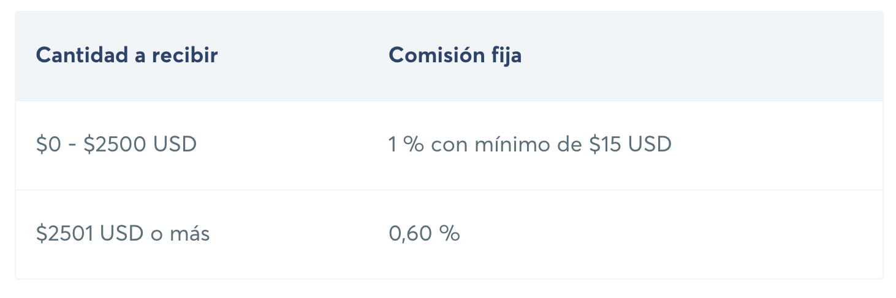
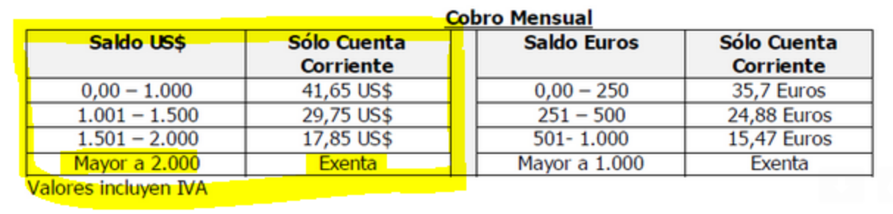
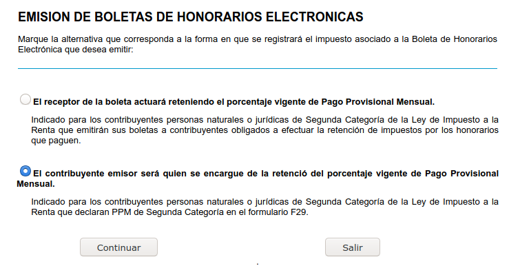

# remoto-desde-chile
Enfocado en desarrolladores y profesiones afines trabajando remotamente desde Chile.

---

⚠️ **Ninguno de nosotros es abogado, ni asesor financiero o tributario. La información en este repositorio NO constituye asesoramiento de ningun tipo. Consulta con un profesional.** ⚠️

---

Este es un trabajo colaborativo, [contribuye](CONTRIBUTING.md)!

* https://polymeris.github.io/remoto-desde-chile/
{:toc}

## Encuentra trabajo

### Formas de trabajo

A grandes rasgos tienes 3 opciones:

1. Trabajar independiente (como _contractor_), sea freelanceando para varias empresas o para una sola. Algunas empresas te tratarán como un empleado más aunque técnicamente no lo seas, pero probablemente no recibas los beneficios que reciben los locales, como seguros de salud.
2. Crear una empresa individual en el extranjero y auto-contratarte en esta. Esto puede tener muchos beneficios financieros, en particular si facturas mucho, pero es una opción mucho más engorrosa.
3. Trabajar para una empresa chilena que preste servicios a un tercero en el extranjero. Esto te ahorra la pega de buscar tus propios proyectos y clientes, pero tienes que tener cuidado: muchas de estas empresas chilenas funcionan como moledoras de carne, no te pagan si no tienes un proyecto, y cuando lo tienes cortan una buena tajada (40% a veces!)

Esta guía considera principalmente la primera opción.

### Preparación

Hablar inglés es casi indispensable, no hay vuelta a eso -- pero la buena noticia es que no tienes que hablar muy bien. En particular, a **nadie** le importa si tienes acento. El mundo del desarrollo está lleno de hablantes no-nativos.

Por lo demás: _créete el cuento_. El nivel del rubro en Chile no es tan bajo como se cree, y si llegaste hasta acá al menos tienes más curiosidad que el promedio.

Eso no quiere decir que tener un buen currículum no ayude. En especial con posiciones remotas las empresas prefieren perfiles más senior, que trabajen más independientemente. Si eres muy novato, considera buscar una empresa que te sirva de trampolín: una empresa con renombre, aunque no sea remota. Una vez que la tengas en tu CV, se hace mucho más fácil.

Para la entrevista: prepárate. Postula a cosas que de verdad te interesen, para tener tiempo de estudiarlos. Aprende sobre la empresa y su producto y ensaya la entrevista en tu cabeza. Sigue yendo a entrevistas aunque tengas pega fija, para mantenerte ejercitado, y quien sabe, quizás encuentras algo que te tinque más.

### Dónde encontrar trabajo

Hay muchísimas plataformas online para buscar trabajo remoto, pero los mejores trabajos se siguen consiguiendo por _networking_: recomendación de tu red de conocidos o en foros, slacks, etc. Busca uno de tu tecnología o nicho y pregunta por el canal de #jobs.

* [devschile](https://devschile.cl/) tiene un canal #pegas con bastante énfasis en lo remoto
* [Hacker News](https://news.ycombinator.com/) publica mensualmente un hilo de "Who's hiring". [Hay](https://findwork.dev/?source=hn) [algunas](https://djqyo3vqv2.execute-api.us-west-1.amazonaws.com/latest/) [herramientas](https://news.ycombinator.com/item?id=10313519) para browsear esos hilos mensuales de forma mas amigable.
* [WeWorkRemotely](https://weworkremotely.com) es, en sus palabras, la comunidad de trabajo remoto más grande del mundo.
* [RemoteOK](https://remoteok.io) fue creada por [Pieter Levels](https://twitter.com/levelsio), quien tambien creó [NomadList](https://nomadlist.com), una comunidad de digital nomads.
* [Remote.com](https://remote.com) muestra puestos disponibles en las empresas más conocidas _a veces_.

## ¿Cuánto cobro?

Harto. Por favor, aprovecha que hay demanda de desarrolladores y cobra caro, nos beneficia a todes que "desarrollador/a en Chile" no sea sinónimo de bajo presupuesto.

Si no tienes idea cuánto es "harto", estas son nuestras sugerencias:

* Junior, literalmente recién formado: 70.000 dólares al año
* Senior, capaz de trabajar independiente y consistemente entregar buenos resultados: 90.000 dólares al año
* Staff o Team Lead, además de los aspectos técnicos de un senior, con habilidades de liderazgo: 110.000 dólares al año
* Senior Staff+... espero que a estas alturas ya tengas una idea

Parte negociando con un 20-30% más de lo que quieres.

Si trabajas como freelancer por hora o día, cobra el doble, tienes que pagar las horas que pasarás buscando proyectos y el tiempo que te dejarán esperando.

Recuerda que los montos que negocias son BRUTOS. Por recibir ese dinero, tendrás que pagar cotizaciones (para salud y jubilación) y además impuestos. Puedes ver más detalles en la sección ["Paga impuestos, salud y cotizaciones"](#paga-impuestos-salud-y-cotizaciones). Si quieres una aproximación rápida de lo que tendrás que pagar, puedes revisar [esta calculadora](https://impuestos.netlify.app/) ([Repo](https://github.com/muzk/impuestos)).

## Recibe tu sueldo

### Transferwise

[Transferwise](https://transferwise.com/invite/u/camilop16) (link con invite) te da una especie de cuenta virtual dónde tu empleador puede depositar como si tuvieras una cuenta en EEUU. Luego tu puedes transferir a cuentas en muchos países, incluyendo Chile.

Limitaciones:
* en el pasado ha tenido limitaciones de monto mensual, pero a Julio 2020 no las hay

Ventajas:
* relativamente barato (a menos que envies montos muy grandes)
* rápido
* todo online

### Cuenta en el extranjero

Limitaciones:
* dificil (o imposible) de abrir, dependiendo del país.
* no es una solución completa ya que igual tienes que enviar el dinero a Chile de alguna manera

Ventajas:
* probablemente más simple para tu empleador
* puedes ahorrar/invertir en el extranjero

### Transferencia Bancaria Internacional

El empleador te envía un pago (conocido por los bancos como "remesa") el cual llega a Chile directamente a tu banco. Para que te puedan enviar este dinero a tu nombre, tienes que entregar los siguientes datos a tu empleador:

    Name: Tu nombre completo
    ID: 11.111.111-1 (tu rut)
    Beneficiary Account: xx-xxx-xxxxx-xx (el número de tu cuenta)
    Bank: <nombre del banco>, p.ej. Banco de Chile - Santiago de Chile
    Branch: <dirección del banco>, p.ej. Ahumada 251 - Santiago
    Swift Code: Swift code de tu banco (consultar con ejecutivo de cuentas)

**Tip**: No es muy común recibir pagos del extranjero, por lo que muchas veces los ejecutivos no tienen idea de esta información. Para evitar confusiones, siempre nombrar la palabra "remesa" al referirse a tu pago.

Puedes recibir tus pagos en cualquier cuenta corriente o vista (ejemplo: [Cuenta RUT](https://www.bancoestado.cl/imagenes/_personas/productos/cuentas/cuenta-rut-home.asp)) que tengas. Sin embargo, siempre consulta con tu ejecutivo de cuentas para proceder. Otra opción es obtener cuenta corriente en dólares y recibir el dinero ahí.

En ambos casos, los datos que debes enviar son los mismos, pero el funcionamiento (como obtienes finalmente tu dinero) es distinto.

#### Comisiones por recibir tu dinero

Tu pago puede verse afecto por dos comisiones:

1. El cobro de los bancos intermediarios, que gira en torno a los 20 USD y que puede que se lo cobren a tu empleador.
    - **Tip**: intenga negociar que esto lo pague tu empleador y que no te lo descuenten del sueldo.
2. La comisión que te cobra el banco chileno por recibir el dinero: depende del Banco. En algunos casos, esta comisón es negociable si recibes periódicamente dinero.

Las comisiones que tengo conocimiento son las siguientes (Info de Enero 2020):

| Banco                  | Comisión por recibir tu pago    |
| -----------------------|:-------------------------------:|
| BICE                   | Gratis                          |
| Scotiabank             | Gratis                          |
| Bci                    | *UM50 + IVA                     |
| Santander              |  ([fuente](https://www.santander.cl/tarifas_comisiones/productos/TransExterior.pdf))    |
| Banco Edwards / Chile  |  ([fuente](https://transferwise.com/es/blog/transferencia-internacional-banco-chile)) |
| Banco Estado           |  ([fuente](https://www.bancoestado.cl/imagenes/_personas/servicios/envio-de-dinero/exterior-chile.asp)) |

*: UM es Unidad Monetaria, que representa la moneda de origen del depósito. Si te depositan dólares, te cobran US$50 + IVA.

#### *Cuenta Corriente* o *Cuenta Vista en Chile*, en pesos chilenos (CLP)

Una vez le pasaste los datos de transferencia a tu empleador:

- te harán una transferencia del pago (en dólares) de su banco al tuyo.
- el pago se demora 1 o dos días hábiles "en llegar".

Ahora el dinero está a tu nombre, en Chile y en tu banco... pero no en tu cuenta. Recuerda que te llegaron USD, así que no puedes pasarlo directamente a tu cuenta en CLP. ¿Qué hacer?

1. Un buen banco con tecnología de punta (😂) te enviará un correo notificándote del pago. En otros casos, tienes que usar _polling_ (😭) y llamar hasta que te digan que llegó
2. Ahora que ya sabes que están los dólares, debes ir a una surcursal.
    - OJO 👀: pregunta en qué surcursal te pueden atender. BancoEstado tiene [sucursales especiales](https://www.bancoestado.cl/imagenes/_personas/noticias/detalle/sucursales-chilenos-exterior.asp) para esto.
    - En el caso del **Bci**: Si bien el proceso es igual de manual que en los otros bancos, Bci permite hacerlo de manera remota, poniéndote en contacto con la ejecutiva que está a cargo de las operaciones en moneda extranjera, quien te enviará una carta para completar donde se define el tipo de cambio y las cuentas en las que se abonará el monto y de donde se descontará la comisión. Basado en experiencias personales, parece ser sólo una persona con su respectivo backup para todo el banco, pero suelen responder rápido.
3. En el mesón de atención de cliente, solicita tus dólares.
    - OJO 👀: en BancoEstado tienes que hablar con el ejecutivo de "Inversiones".
4. El ejecutivo te generará un voucher que debes pagar en caja (son las comisiones del banco, ver sección anterior)
    - En algunos bancos, como el Itaú, te descuentan directamente de tu cuenta corriente
5. Con el número que ya sacaste, espera tu turno en caja.
6. En caja, paga la comisión del banco y aquí puedes pedir los dólares en efectivo o que te abonen los dólares a tu cuenta o pagar tu tarjeta de crédito. Los dólares en efectivo te sirven por si quieres venderlo a alguien que te de más dinero por ellos.

Nota personal: creo que en todos los bancos va a ser parecido. Espero que alguno tenga opción para hacer este trámite _remotamente_... sin embargo, si vas a recibir muchos sueldos, es mejor recibir en una cuenta corriente en dólares.

#### Cuenta corriente en Chile, en dólares

Una vez le pasaste los datos de transferencia a tu empleador:

- te harán hará una transferencia del pago (en dólares) de su banco al tuyo.
- el pago se demora 1 o dos días hábiles "en llegar".
- el pago llega y estará disponible en tu cuenta corriente en dólares ✌️
- ahora puedes vender dólares, y los pesos chilenos serán depositados en tu cuenta corriente
- también puedes pagar tu cuenta internacional (ej: tus compras de AliExpress o Uber) directamente con tus dólares 😉 

Es muy cómo que el pago te llegue y que más encima puedas venderlos sin ir a una oficina con depósito a tu cuenta en CLP.

Eso sí, es importante tener cuenta que:

- tener cuenta corriente en en dólares **no te salva de la comisión que tu banco te pueda cobrar** por el hecho de recibir tu dinero.
- algunos bancos no tienen implementada la funcionalidad en sus páginas o apps de vender dólares (ej: BICE), por lo que para vender tienes que enviarle un correo a tu ejecutivo.
- el tipo de cambio suele ser mejor que el que te dan en caja
- la cuenta corriente podría tener costos de mantención asociados.

**¿Cómo abrir cuenta corriente en dólares?**

Dile a tu ejecutivo que quieres abrir cuenta en dólares porque recibes tu sueldo en USD via remesa internacional. Él te dirá como proceder. Algunas consideraciones:

- es normal que te pidan demostrar la "legalidad" de esos pagos (puedes mostrar un contrato).
- es normal que te pidan recibos de pagos anteriores si ya has recibido pagos anteriormente.
- si te pagan mensualmente, díselo a tu ejecutivo. Darle el contexto completo siempre ayuda.

**¿Cuáles son las comisiones de una cuenta corriente en dólares?** (Info Enero 2020)

| Banco         | Comisión por recibir tu pago   |
|---------------|:------------------------------:|
| Santander     | $0 ([fuente](https://banco.santander.cl/tarifas-y-comisiones/santander/cuenta-corriente/archivos/cuenta-corriente-moneda-extranjera)) |
| BICE          | $0                             |
| Scotiabank |  |

#### Tipo de Cambio

El tipo de cambio depende de cómo vendas tus dólares:

1. si vendes en sucursal, el precio tiende a ser más conservador (y por ende menor) a otros medios.
    - a veces conviene cruzar la calle para ir a venderlos al Banco de al frente (mientras no haya mucha fila...), o a una casa de cambios, pero tendrás que esperar que la viejita revise cada billete
2. si vendes en página web desde tu cuenta corriente (o llamando a tu ejecutivo) el precio varía según mercado. Es decir, un mismo día pueden haber muchas variaciones. Mi experiencia con esta modalidad ha sido:
    - Banco BICE: valor que te dan es muy similar al de [valor-dolar.cl](https://valor-dolar.cl/)
    - Banco Scotiabank: valor inferior al de valor-dolar.cl (5-10 pesos)
 
#### TLDR;

- Tu empleador te puede enviar USD a tu cuenta chilena.
- Aquí hay comisiones que le cobran a este por enviar (~20USD) y a ti por recibir (~0.6%, aunque en algunos bancos no te cobran).
- Puedes recibir tu pago en cualquier tipo de cuenta (incluso cuenta RUT) aunque en cuentas vistas pueden haber límites de montos.
- Si recibes en cuenta corriente en pesos Chilenos, tienes que ir a sucursal a retirar los dólares 🙃, a menos que tengas una cuenta en el Bci. Ahí puedes venderlos al mismo banco, _pero_ considera que el tipo de cambio es conservador.
- Si recibes en cuenta corriente en dólares, el abono se hace automáticamente y puedes vender los dólares a través de las plataformas web o llamando a tu ejecutiv@. El tipo de cambio varía con el mercado, un mismo día pueden haber distintos valores. Compara el valor que te ofrecen con el de la página [valor-dolar.cl](https://valor-dolar.cl/).
- Para abrir cuenta en dólares te pueden pedir ciertos requisitos, preguntar a ejecutiv@.
- Uno de los mejores bancos para recibir dinero del exterior es el BICE por las siguientes razones:
    - cuenta corriente en dólares no tiene costo
    - no hay comisión por recibir el dinero
    - el tipo de cambio es muy cercano al de la página valor-dolar
    - si bien la barrera de entrada al banco es alta (es ABC1 😂) te piden pocas cosas para la cuenta en dólares

## Paga impuestos, salud y cotizaciones

### Emisión de boletas

Suponiendo que la empresa para la que trabajas no tiene presencia legal en Chile, debes emitir boleta de honorarios via [la página web del SII](http://homer.sii.cl/). Elige la opción que el contribuyente emisor (tú) retiene el Pago Provisional Mensual.

El SII tiene un RUT especial para empresas extranjeras: 44.444.446-0. En el campo de región puedes poner cualquier cosa, pero la dirección debería ser la real de la empresa.

Si te pagan en dólares, usa la [tabla dólar-peso del SII](http://www.sii.cl/valores_y_fechas/dolar/dolar2020.htm) para convertir el total.

### Impuestos mensuales

Si tu retuviste el Pago Provisional Mensual al emitir la boleta, debes declarar (**y, muy importante, pagar!**) impuestos mensuales usando el formulario F29 [la web del SII](http://homer.sii.cl/). La página calcula el monto por ti a partir de las boletas electrónicas del mes anterior (un 10,75% de éstas), y luego puedes pagar online con tu banco. Cuando se habla de "devolución de impuestos" este es el dinero que se te devuelve, si sobra algo luego de tramitar tu declaración de impuestos anual.

### Cotizaciones mensuales

Tienes la opción de pagar AFP y Salud mensualmente o anualmente. Más abajo se explica como pagarlas anualmente.

(TODO: explicar pago mensual usando previred)

### Declaración anual

La "operación renta" es el cálculo y pago de impuestos y cotizaciones que cada año tienes que hacer del año anterior. Por ejemplo en Abril del 2021 paga impuestos sobre lo que ganaste el año 2020.
Si eres independiente en esta ocasión también tienes que pagar tus cotizaciones (TODO buscar excepciones).

El cálculo del monto exacto es bastante complicado, pero **simplificando mucho** la idea general es que de la suma de lo que pagaste mensualmente se le restan los impuestos, salud y AFP. Si sobra, te devuelven. Si falta, te lo cobran. En línea de esta simplificación, puedes ver la ["Calculadora de impuestos"](https://impuestos.netlify.app/) que te ayuda a estimar cuánto le deberías pagar por impuestos y cotizaciones.

El SII te prepara una propuesta de formulario F22 con la información que tiene de tus pagos mensuales y lo que le informan diversas instituciones.

La empresa para la que trabajas en el extranjero tendrá que declarar lo que te paga también. Es probable que para esto te pidan una declaración de que no pagas impuestos allá, y que tu te haces responsable por pagar tus impuestos en Chile. En el caso de empresas de EEUU esto se hace con [el formulario W-8](https://www.irs.gov/pub/irs-pdf/fw8ben.pdf).

#### Impuestos en la declaración anual

Hay distintos tipos de impuestos anuales, pero si tu ingreso principal es por boletas a una empresa extranjera, te interesa el _Impuesto Global Complementario_.

El impuesto se aplica sobre tu "base imponible", que se calcula como `BASE_IMPONIBLE = SUELDO_BRUTO - GASTOS`, donde:

- `SUELDO_BRUTO` es tu sueldo bruto anual.
- `GASTOS` son tus gastos. Por defecto, se calculan como el 30% de tu ingreso bruto hasta un máximo de 15UTA (~9 millones). Lo que quiere decir que mientras no ganes más de ~30 millones, tu imponible es el 70% de tu bruto. OJO que las cotizaciones obligatorias se asumen dentro de `GASTOS`, así que no reducen directamente tu imponible para impuestos.

Con tu imponible en mano, ya puedes estimar cuanto pagarás de impuestos: `IMPUESTOS = BASE_IMPONIBLE * FACTOR - REBAJA`

El `FACTOR` y `REBAJA` extraen de la "tabla impuesto global complementario" (ejemplo declaración 2020):

| desde        | hasta       | factor | a rebajar      |
|-------------:|------------:|:-------|---------------:|
| $ 0          | $ 8.038.926 | 0      | $0,00          |
| $8.038.926   | $17.864.280 | 0,04   | $321.557,04    |
| $17.864.280  | $29.773.800 | 0,08   | $1.036.128,24  |
| $29.773.800  | $41.683.320 | 0,135  | $2.673.687,24  |
| $41.683.320  | $53.592.840 | 0,23   | $6.633.602,64  |
| $53.592.840  | $71.457.120 | 0,304  | $10.599.472,80 |
| $71.457.120  | y más       | 0,35   | $13.886.500,32 |

Por ejemplo, si tu bruto fue $20.000.000 en el 2019, quiere decir que tu base imponible es `0.7 * 20M = 14.000.000`. Si miras la tabla, estás en el tramo del 4% (`FACTOR = 0.04` y `REBAJA = 321.557,04`). Finalmente, usando la fórmula, el impuesto es igual a `14.000.000 * 0.04 - 321.557,04 = $238.442,96`. Un impuesto efectivo de ~1.19% sobre los 20 millones que ganaste.

Si eres 🚀 y ganas $60.000.000, el cálculo queda así:
- Para los gastos: como el 30% de 60M es mayor a 15UTA, tus gastos quedan en 15UTA (aproximadamente 9 millones).
- Así que tu imponible es igual a `60M - 9M = 51M`
- Con este imponible quedas en el tramo `0,23`
- Así que usando la fila de factor 0,23 calculas el impuesto `$51.000.000 * 0,23 - $6.633.602,64 = $5.096.397,36`
- Eso es un ~8,5% de impuesto efectivo

#### Cotizaciones en la declaración anual

Las cotizaciones de los trabajadores independientes se calculan en su declaración de renta anual. Entre los años 2019 y 2027 puedes elegir entre una cotización total o parcial. En la cotización total, cotizas por el 100% de tu base imponible, mientras que en la parcial cotizas por un porcentaje de tu base imponible (pagas menos). En el 2019, la parcial era un 5% (va subiendo año a año hasta llegar al 100%).

El cálculo de las cotizaciones se hace sobre una base imponible diferente a la que se usa para calcular tus impuestos. Esta base imponible es igual al 80% de tu sueldo bruto ([fuente](http://www.sii.cl/ayudas/ayudas_por_servicios/2032-cp-2035.html)) hasta un máximo de 962,4UF anual ([fuente](https://www.spensiones.cl/portal/institucional/594/w3-article-13843.html)).

El pago a la AFP corresponde a un 10% de tu base imponible + comisión. Por ejemplo, si el año anterior ganaste 1 millón al mes, y la comisión de la AFP es 1.5% pagarás `$1.000.000 * 12 * 0,1115 * 0.8 ~= $1.070.400`, mientras que si ganaste 3 millones al mes pagarás lo mismo que si ganaras ~2 millones, que es aproximadamente el tope: `$2.000.000 * 12 * 0.8 * 0,115 ~= $2.208.000`. Si te vas por _parcial_ (5%), lo que tendrás que pagar es el 5% de cada uno de esos montos. Es decir, `1.070.400 * 0.05 = $53.520` y `2.208.000 * 0.05 = $110.400`.

El monto que pagas en salud es igual al 7% de la base imponible, independiente si estás en isapre o en fonasa. Si estás en isapre, el 7% va a ser mayor o menor que el monto que pagas en tu plan. Si es mayor, habrá un exceso que la isapre debería devolverte. Si es menor, mes a mes tendrás que pagar la diferencia.

Si optas por _cotización parcial_, pagarás mucho menos, pero quedarás con cobertura parcial de salud a menos que pagues la diferencia durante el año. Y obviamente, ahorras menos en tu AFP. El porcentaje que pagas en cotización parcial comparado con total es:

| 2020 | 2021 | 2022 | 2023 | 2024 | 2025 | 2026 | 2027 |
|------|------|------|------|------|------|------|------|
| 17%  | 27%  | 37%  | 47%  | 57%  | 70%  | 80%  | 90%  |

El SII tiene [algunos ejemplos online](http://www.sii.cl/destacados/renta/2019/casos_declarar.html) para entender mejor la diferencia entre cobertura total y parcial.

Además de AFP y Salud, pagas algunas cosas comparativamente chicas como seguros de invalidez y de accidentes de trabajo. El porcentaje que pagas en esos items es el 2.46%, sobre tu base imponible total (no puedes optar parcial en estos casos).

## Stock options/RSUs

Primero, nuevamente el disclaimer: Estas cosas son complicadas y puedes perder **mucha** plata invirtiendo y/o pagando impuestos. Si tienes stock options o algo así, asume que todo lo que dice aquí es falso y habla con profesionales financieros y tributarios.

Stock options y RSUs son beneficios que te dan algunas empresas como complemento de tu sueldo. La idea es que si a la empresa le va bien, tu también ganas.

Los stock options en general son entregados por startups, y consisten en la _opción_ de comprar acciones a un precio determinado, el llamado _strike price_. En caso de que la empresa crezca, se asume que el valor real de las acciones irá aumentando mientras el strike price se mantiene. Si el startup falla (que es probable!) o su valor no aumenta, las opciones **no valen nada**.

Por ejemplo te podrían ofrecer 30.000 options con un strike price de $1 cuando entras a trabajar. 4 años después, la empresa se vende (o entra a la bolsa) y sus acciones valen $5. En principio, esto significa que puedes _ejercer_ tus opciones por $30.000 y venderlas por $150.000, ganando $120.000, menos impuestos.

¿Porqué "en principio"? Porque hay muchos factores que pueden cambiar esto. Por ejemplo, en algunos casos la empresa tiene que levantar capital en malas condiciones y se ve obligada a emitir _preferred stock_ a los nuevos inversionistas. Luego la empresa se vende y los empleados con acciones comunes y corrientes no reciben un peso. Como dije, es complicado, asesórate.

Además, típicamente no te dan todo las opciones o RSUs inmediatamente, si no que te las van entregando gradualmente en un proceso que se llama [vesting](https://carta.com/blog/what-is-stock-vesting/).

Para ejecer tus stock options eventualmente tendrás que tener dólares (o la moneda en la que se vendan las acciones), para poder pagarle a tu empresa. Si quieres poder hacerlo, probablemente te conviene ir ahorrando dólares desde un comienzo y encontrar una manera de transferir que no sea excesivamente cara, usando uno de los métodos descritos en "Recibe tu sueldo" pero a la inversa.

Las RSUs en general son entregadas por empresas que ya son públicas o más establecidas. Es parecido a tener un stock option con strike price de $0, esto es, no tienes que ejercerlas, te dan las acciones directamente.

## Tengo más preguntas

Pásate por el canal #remoto de [el slack de devschile](https://devschile.cl/).
